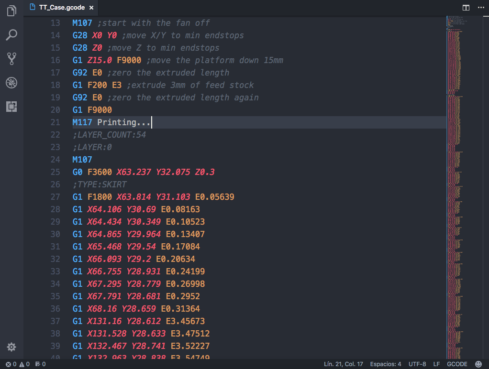
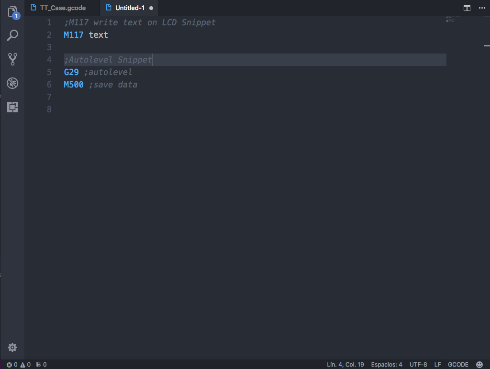

# GCODE Language Support

This is a simple extensions that adds support for the GCODE language, that means that it add syntaxis and some snippets
## Features

#### Language Syntaxis

#### Some Snippets

## Known Issues
None 😎

## Release Notes

First Release! 🎉

## TODO

⏺ &nbsp; Write snippets for all the *GCODE* functions

### 0.2.0
Initial Release
